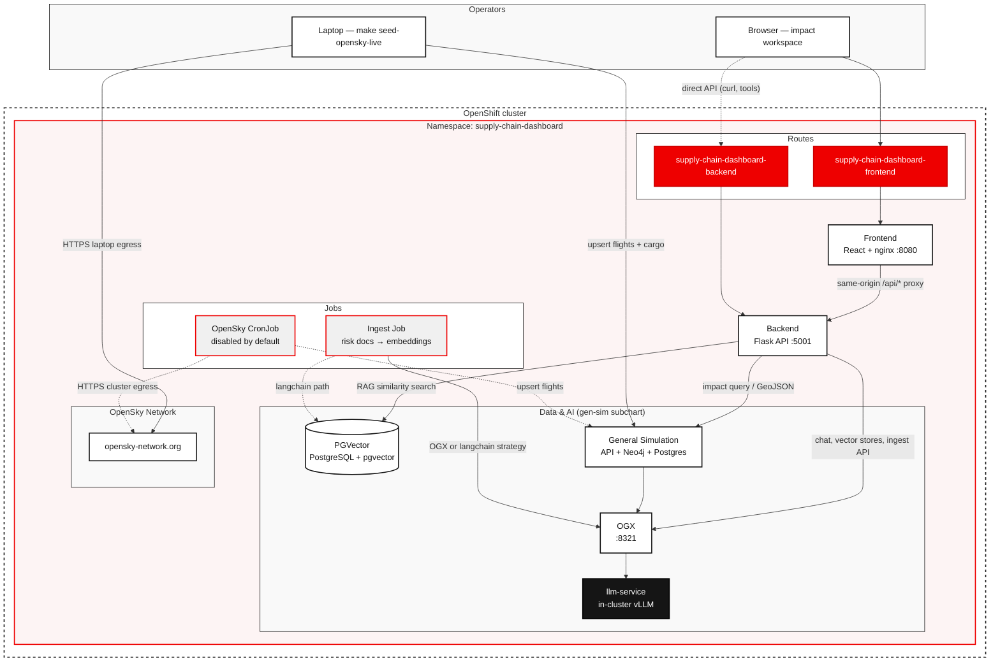
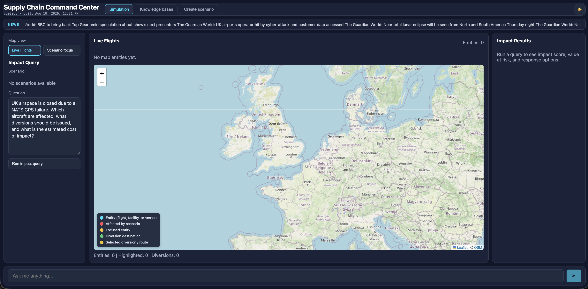
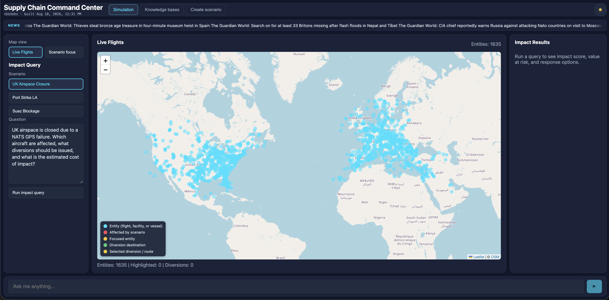

# Simulate Supply Chain Disruptions with Neo4J

<!-- TITLE: Simulate supply chain disruptions with RAG -->

Help supply chain and logistics operators simulate disruptions and query risk documents with a RAG chatbot on OpenShift AI.

<!-- SHORT DESCRIPTION: Help logistics operators simulate disruptions and query risk documents with a RAG chatbot on OpenShift AI. -->

## Table of Contents

- [Overview](#overview)
- [Detailed description](#detailed-description)
  - [See it in action](#see-it-in-action)
  - [Architecture diagrams](#architecture-diagrams)
- [Requirements](#requirements)
  - [Minimum hardware requirements](#minimum-hardware-requirements)
  - [Minimum software requirements](#minimum-software-requirements)
  - [Required user permissions](#required-user-permissions)
- [Deploy](#deploy)
  - [Prerequisites](#prerequisites)
  - [Installation](#installation)
  - [Validating the deployment](#validating-the-deployment)
  - [Delete](#delete)
- [Repository structure](#repository-structure)
- [References](#references)
- [Technical details](#technical-details)
- [Tags](#tags)

## Overview

This quickstart gives supply chain operators a live impact workspace on OpenShift AI. Teams can run what-if disruption scenarios, inspect affected shipments and diversions on a map, and ask a RAG chatbot questions grounded in curated risk documents. After deploying, you have a browser dashboard plus APIs for simulation, chat, and knowledge-base management.

## Detailed description

Global supply chains are exposed to port strikes, airspace closures, canal blockages, and similar events. Traditional dashboards can raise alerts, but they do not reason about downstream impact or recommend diversions. Operators still have to piece together reports and expert judgment under time pressure.

This quickstart deploys an interactive supply chain impact workspace backed by a OGX AI LLM, a PGVector knowledge base, and a general-simulation impact engine. Operators pick a seeded scenario, run a natural-language impact query, review score, value at risk, affected entities, and recommended diversions on a Leaflet map, and chat with a RAG assistant grounded in risk analyses.

Typical use cases include operations centers modeling a Port of Los Angeles strike, a Suez blockage, or a GPS/airspace event before committing to a response. After deployment you can:

- Run seeded disruption scenarios and inspect spatial impact on a map
- Chat with a RAG assistant that auto-matches a OGX AI vector store by scenario
- Upload `.txt`, `.md`, or `.pdf` risk documents at runtime (a Helm post-install job also loads bundled analyses)
- Propose and create new scenarios from natural language

### See it in action

- [What to expect after deployment](./docs/WHAT_TO_EXPECT.md) — walkthrough of the Simulation, Knowledge bases, and Create scenario screens

For a longer product narrative (audience, problem statement, and demo scenario catalog), see [DETAILED_DESCRIPTION.md](DETAILED_DESCRIPTION.md).

### Architecture diagrams

Operators reach the impact workspace through an OpenShift Route. The Flask backend proxies general-simulation impact queries, RAG chat, and knowledge-base management. OGX AI, PGVector, and the general-simulation subchart provide inference, retrieval, and spatial impact. Flight positions on the map come from OpenSky: the in-cluster CronJob is off by default (hyperscaler IPs are often blocked), so operators typically seed from a laptop with `make seed-opensky-live`.

Open [docs/openshift-architecture.html](docs/openshift-architecture.html) in a browser for an OpenShift-oriented layout of Routes, subcharts, request flows, and how chat tools run in Flask.



Impact queries go from the UI through Flask to general-simulation. RAG chat streams from Flask through OGX AI to LiteMaaS. Flask advertises function tools on the chat-completions call; OGX AI forwards inference, and the backend runs tool calls (knowledge base, general-simulation, RSS) for up to three rounds. OpenSky flight states are pulled outside the request path and upserted into general-simulation Postgres and Neo4j (laptop seed, or the optional CronJob).

## Requirements

### Minimum hardware requirements

**Application (MaaS — no in-cluster LLM):**

- CPU: 4 vCPU
- Memory: 16 GB
- GPU: not required
- Storage: 20 GB (PGVector + app)
- Models: Qwen3.6-35B-A3B, Qwen3.8-27B

`helm/values.yaml` uses LiteMaaS (`global.models.external-model`). GPU is not required.

### Minimum software requirements

Tested with OpenShift AI 3.4+ on OpenShift 4.21+.

| Component | Tested version |
|-----------|----------------|
| OpenShift | 4.21+ |
| OpenShift AI | 3.4+ |
| Helm | 3.14+ |
| OGX AI | via `general-simulation` subchart (from [general-simulation](https://github.com/robertsandoval/general-simulation) chart 0.0.1) |
| Python | 3.12 |
| Node.js | 22 (frontend builds) |
| `oc` CLI | Recommended for deploy status and troubleshooting |

### Required user permissions

This quickstart can be deployed by a user with:

- Permission to create projects/namespaces
- Namespace **admin** on the target project (sufficient to create Routes, Deployments, Services, and a Job)
- Permission to deploy applications via Helm

No cluster admin access is required for the default MaaS path.

## Deploy

Defaults used below (overridable on `make`, for example `make helm-install NAMESPACE=my-ns`):

| Setting | Default |
|---------|---------|
| Helm chart | `./helm` |
| Release name | `supply-chain-dashboard` |
| Namespace | `supply-chain-dashboard` |
| Values file | `helm/values.yaml` |

Run `make help` for the full target list. `make helm-install` creates the project if needed and updates chart dependencies.

### Prerequisites

Before deploying, ensure you have:

- Access to a Red Hat OpenShift cluster with OpenShift AI 3.4+ installed
- `oc` CLI installed and authenticated
- `helm` CLI 3.14+ installed (`make` invokes Helm)
- API token for your MaaS / LiteMaaS (OpenAI-compatible) model endpoint
- Network access from the cluster to the model endpoint (and outbound HTTPS if you enable RSS news)

General Simulation uses its **own** OpenAI credentials (`api.llm` / `ingestion.llm` in secrets) — not LiteMaaS.

### Installation

1. Clone the repository:

```bash
git clone https://github.com/rh-ai-quickstart/ai-supply-chain-agent.git
cd ai-supply-chain-agent
```

2. Configure secrets. Set your MaaS / LiteMaaS API token so OGX AI can call `global.models.external-model`. Copy the example file and edit it:

```bash
cp helm/secrets.example.yaml helm/secrets.yaml
# Edit helm/secrets.yaml and set general-simulation.llm-service.secret.hf_token
```

`make helm-install` applies `helm/secrets.yaml` automatically if it exists. To pass the token without writing it to a file:

```bash
make helm-install HELM_EXTRA_ARGS='--set global.models.external-model.apiToken=<your-maas-token>'
```

3. Install using `helm/values.yaml` which enables model in `global.models.external-model`:

```bash
make helm-install
```

To upgrade an existing release:

```bash
make helm-upgrade
```

If you have an existing model endpoint, pass the model name, URL, and API key:

```bash
make helm-install HELM_EXTRA_ARGS='--set global.models.external-model.id=YOUR_MODEL_NAME --set global.models.external-model.url=YOUR_MODEL_ENDPOINT --set global.models.external-model.apiToken=YOUR_API_KEY'
```

> **Note**: `global.models.external-model.url` should be the full URL including protocol and path if needed (for example `https://my-model.example.com/v1`).

The umbrella chart in `helm/` deploys the frontend Route, Flask backend, PGVector, OGX AI (MaaS / Qwen), general-simulation (own Postgres + Neo4j + API), an optional ingest Job, and an optional egress NetworkPolicy. Live OpenSky CronJob is **off** by default. Do not set `general-simulation.api.models.generation` in `helm/secrets.yaml` — that overlay wins over `values.yaml` and will send the wrong model id to OGX AI.

#### Testing model access (before deploying)

You can verify the MaaS endpoint is reachable **before** installing:

```bash
oc run test-model-access --rm -it --restart=Never \
  --image=registry.access.redhat.com/ubi9/ubi-minimal:latest \
  -- /bin/sh -c 'curl -sf --max-time 10 \
    -H "Authorization: Bearer YOUR_API_KEY" \
    -H "Content-Type: application/json" \
    -d "{\"model\": \"YOUR_MODEL_NAME\", \"messages\": [{\"role\": \"user\", \"content\": \"Say hello in one word.\"}], \"max_tokens\": 10}" \
    "YOUR_MODEL_ENDPOINT/v1/chat/completions" && echo "" && echo "SUCCESS" || echo "FAILED"'
```

Replace `YOUR_API_KEY`, `YOUR_MODEL_NAME`, and `YOUR_MODEL_ENDPOINT` with your actual values.

To build and push images instead of using the default Quay images: `make build` then `make release REGISTRY=quay.io/<your-org>`.

### Validating the deployment

#### 1. Check pods, services, and routes:

Run the following command.

```bash
make oc-status
```

Wait until backend, frontend, pgvector, OGX (formerly llamastack), and general-simulation pods are **Running** and the ingest job (if enabled) has **Completed**. First startup can take several minutes while OGX AI becomes ready.

#### 2. Open the frontend Route URL:

After running the `oc status` command finishes the initial page should look like:



For this demo we still need to seed the full data set.

#### 3. Seeding Data

Next is to seed general-simulation map data (required for scenarios and markers). Gen-sim’s in-cluster OpenSky job is disabled by default — OpenSky often blocks hyperscaler IPs. From a laptop with `oc` login and a sibling [general-simulation](https://github.com/robertsandoval/general-simulation) checkout:

First seed the scenarios: 
```bash
make seed-gen-sim
```

Next install actual flight data from the OpenSky Data API. 

```bash
make seed-opensky-live GEN_SIM_NAMESPACE=supply-chain-dashboard
```

This will fetch 2000 live flights from the API and upsert the records into PGVector and Neo4j giving us data to actually use. This seed script will also assign arbitrary values of cargo to each flight. This mock data is just a place holder you can add more 'metadata' to the graph to store more info. 

Once complete you should see a page like:



Each icon is a single flight with cargo associated. 

#### 4. Optional — re-run knowledge-base ingestion without a full upgrade:

```bash
make ingest
make ingest-status
make ingest-logs
```

Go to the Knowledge base page located in the top bar navigation and verify there are three knowledge bases like in the image below. 


Each vector db is associated to a scenario so context stays relevant.

#### 5. Running Simulations: 

In the left hand panel there are options for scenarios to run. Click `Uk Airspace Closure` in the UI. 


After the scenrio runs you will notice the map zoom to the location of the event. Once zoomed in in the right panel you will be able to read the result. 


You should be able to select flight redirect for each flight which will show as follows on the map: 


#### 6. After running the scenarios data is injected into the agents memory and you can ask follow up questions about that type of event. 

- Verify that the responses stream back and are relevant. 

#### 7. Creating a new Scenario. Again in the top bar of the application click the create scenario. The page looks as follows:


Create a scenario by using natural language like "Simulate what would happen if a volcano erupts in Italy."

The LLM will then populate pre defined fields which you can further refine then run! 


Once ran it will bring you back to the home page where you can converse with the agent about said Scenario. 

#### 8. Live News Feed:
There is a RSS based live news feed which is injected into the context of the agent. The agent is aware of current events and you can converse about how they might effect the process. 


### Delete

To completely remove the deployment:

```bash
make helm-uninstall
```

Optionally delete the project:

```bash
oc delete project supply-chain-dashboard
```

## References

- [What to expect after deployment](./docs/WHAT_TO_EXPECT.md)
- [OpenShift architecture (HTML)](./docs/openshift-architecture.html)
- [OGX documentation](https://ogx.readthedocs.io)
- [LangChain PGVector integration](https://python.langchain.com/docs/integrations/vectorstores/pgvector/)
- [React Leaflet](https://react-leaflet.js.org/)
- [OpenShift AI documentation](https://docs.redhat.com/en/documentation/red_hat_openshift_ai_self-managed)

## Technical details

The backend exposes `/healthz`, `/readyz`, `/api/v1/version`, general-simulation scenario/query/GeoJSON routes, streaming RAG chat (`POST /api/v1/chat`), vector-store and knowledge-base APIs, scenario propose/create, and RSS news (`GET /api/v1/news`).

Set `global.models.external-model.apiToken` in `helm/secrets.yaml` to a literal token (copy from `secrets.example.yaml`). Do not use `${env.VAR}` — the OGX AI init script will hit bash `bad substitution`.

The backend uses `LLAMA_STACK_URL`, `LLAMA_STACK_MODEL`, `EMBED_MODEL`, PostgreSQL connection settings, `GENERAL_SIMULATION_BASE_URL` (chart default `http://general-sim-api:8000`), and optional `NEWS_FEED_URLS`. The ingest job uses `INGEST_STRATEGY` (`llamastack` by default, or `langchain` for PGVector). The frontend nginx proxy uses `BACKEND_UPSTREAM` at runtime.

Optional Helm overrides include custom image repositories, `frontend.apiProxyUpstream`, `global.models.external-model.id` / `url`, `backend.env.EMBED_MODEL` / `LLAMA_STACK_URL`, `pgvector.secret.*`, `ingest.strategy`, `general-simulation.api.llm.*`, `general-simulation.ingestion.enabled` (keep `false` on hyperscaler clusters), and `networkPolicy.egress.*`.

Frontend: React 19, Vite 7, Leaflet, react-markdown. Backend: Flask, OpenAI-compatible OGX AI client, LangChain + PGVector, psycopg. Local setup and quality gates (`make lint`, `make test`, `make pre-commit`, `make helm-test`) are in [CONTRIBUTING.md](CONTRIBUTING.md).

## Tags

<!--
Title: Simulate supply chain disruptions with RAG
Description: Help logistics operators simulate disruptions and query risk documents with a RAG chatbot on OpenShift AI.
Industry: Manufacturing
Product: OpenShift AI
Use case: AI agents, RAG, supply chain intelligence
Contributor org: Red Hat
-->

**Title:** Simulate supply chain disruptions with RAG  
**Description:** Help logistics operators simulate disruptions and query risk documents with a RAG chatbot on OpenShift AI.  
**Industry:** Manufacturing  
**Product:** OpenShift AI  
**Use case:** AI agents, RAG, supply chain intelligence  
**Partner:** N/A  
**Contributor org:** Red Hat
