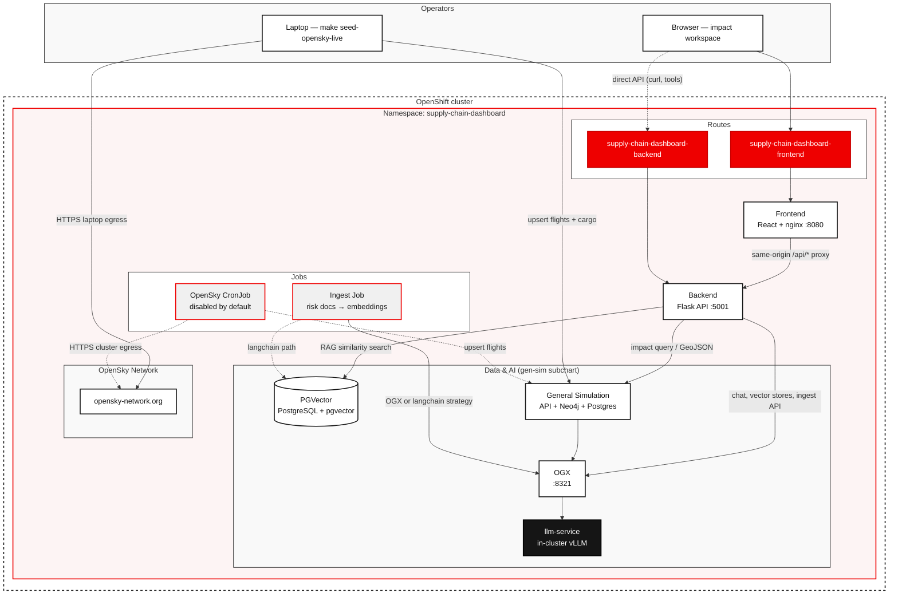

# Handle Supply Chain Disruptions with agentic AI

<!-- TITLE: Handle Supply Chain Disruptions with agentic AI -->

Help logistics operators simulate disruptions and query risk documents with a agentic AI on Red Hat® OpenShift® AI.

<!-- SHORT DESCRIPTION: Help logistics operators simulate disruptions and query risk documents with agentic AI on OpenShift AI. -->

## Table of Contents

- [Detailed description](#detailed-description)
  - [See it in action](#see-it-in-action)
  - [Architecture diagrams](#architecture-diagrams)
- [Requirements](#requirements)
  - [Minimum hardware requirements](#minimum-hardware-requirements)
  - [Minimum software requirements](#minimum-software-requirements)
  - [Required user permissions](#required-user-permissions)
- [Deploy](#deploy)
  - [Prerequisites](#prerequisites)
  - [Installation](#installation)
    - [Deploy](#deploy-1)
    - [Check pods, services, and routes](#check-pods-services-and-routes)
    - [Open the frontend Route URL](#open-the-frontend-route-url)
    - [Seed Data](#seed-data)
    - [Ingest knowledge bases](#ingest-knowledge-bases)
  - [Exploring the deployment](#exploring-the-deployment)
    - [Running Simulations](#running-simulations)
    - [Ask impact questions](#ask-impact-questions)
    - [Create a new Scenario](#create-a-new-scenario)
    - [Live News Feed](#live-news-feed)
    - [Modifying the application](#modifying-the-application)
  - [Delete](#delete)
- [Reference](#reference)
- [Tags](#tags)

## Detailed description

Global supply chains are exposed to port strikes, airspace closures, canal blockages, and similar events. Traditional dashboards can raise alerts, but they do not reason about the downstream impact or recommend diversions. Operators still have to piece together reports and expert judgment under time pressure.

This quickstart deploys an interactive supply chain impact workspace backed by an agent running in OGX, a PGVector knowledge base, and a general-simulation impact engine. Operators pick a seeded scenario, run natural-language impact queries, review scores, values at risk, affected entities, and recommended diversions on a Leaflet map, and chat with a RAG assistant grounded in risk analyses.

Typical use cases include operations centers modeling a Port of Los Angeles strike, a Suez blockage, or a GPS/airspace event before committing to a response. After deployment you can:

- Run seeded disruption scenarios and inspect spatial impact on a map
- Chat with a RAG assistant that auto-matches an OGX vector store by scenario
- Upload `.txt`, `.md`, or `.pdf` risk documents at runtime
- Propose and create new scenarios from natural language

### See it in action

- TODO: - link to video to be inserted here

### Architecture diagrams

The quickstart consists of the following main components:
* Frontend - React-based UI which allows the user to interact with simulated events and to visualize the impact of these events on the supply chain.
* Backend application - Flask-based backend for the frontend
* General Simulation engine - uses domain-specific data (for example flight data) to simulate the impact of events on your supply chain
* Supply chain agent - agent built with [Langchain](https://github.com/langchain-ai/langchain) and [OGX](https://github.com/ogx-ai/ogx) which consumes uploaded risk documents and data generated from the general simulation engine to reason about and answer questions about supply chain disruptions.

Flight positions on the map come from [OpenSky](https://opensky-network.org/).
As OpenSky often blocks hyperscaler IPs by default, this data is seeded from the user's laptop.

Supply chain impact queries go from the UI through Flask to the general-simulation engine and the supply chain agent. Chat interactions are handled by the Flask backend and flow through a Langchain agent to OGX and then to a locally deployed or external model. External models are often hosted in an OpenShift AI Model-as-a-Service (MaaS) instance.

Tools are provided to the agent so that it can consume event-specific data from uploaded knowledge bases (in PGVector), the general-simulation engine results for the impact queries, and an RSS feed, enabling it to provide in-depth analysis and insight.




## Requirements

### Minimum hardware requirements

- CPU: 4 vCPU
- Memory: 16 GB
- GPU: only required if running model locally. Size to model being used. 
- Storage: 20 GB (PGVector + app)
- Models: tested with - Qwen3.6-35B-A3B, Qwen3.8-27B

### Minimum software requirements

Tested with OpenShift AI 3.4+ on OpenShift 4.21+.

| Component | Tested version |
|-----------|----------------|
| OpenShift | 4.21+ |
| OpenShift AI | 3.4+ |
| Helm | 3.14+ |
| Python | 3.12 |
| Node.js | 22 (frontend builds) |
| `oc` CLI | Recommended for deploy status and troubleshooting |

These need to be installed before deploying the quickstart.

### Required user permissions

This quickstart can be deployed by a user with:

- Permission to create projects/namespaces
- Namespace **admin** on the target project (sufficient to create Routes, Deployments, Services, Jobs through helm deployments)

## Deploy

The quickstart uses these values by default (overridable on `make`, for example `make helm-install NAMESPACE=my-ns`):

| Setting | Default |
|---------|---------|
| Helm chart | `./helm` |
| Release name | `supply-chain-dashboard` |
| Namespace | `supply-chain-dashboard` |
| Values file | `helm/values.yaml` |

Run `make help` for the full target list.

### Prerequisites

Before deploying, ensure you have:

- Access to a Red Hat OpenShift cluster with OpenShift AI 3.4+ installed
- `oc` CLI installed and authenticated
- `helm` CLI 3.14+ installed (`make` invokes Helm)
- API token for your OpenAI-compatible model endpoint
- Network access from the cluster to the model endpoint
- Outbound HTTPS so that the quickstart can access the RSS news feed

### Installation

TODO: - add explanation of how to deploy with local models instead of external
      models after we test/confirm that.

#### Deploy

1. Clone the quickstart and general-simulation repositories

```bash
git clone https://github.com/rh-ai-quickstart/ai-supply-chain-agent.git
git clone https://github.com/rh-ai-quickstart/general-simulation.git
cd ai-supply-chain-agent
```

2. Configure secrets

Start by making a copy of the default secrets file:

```bash
cp helm/secrets.example.yaml helm/secrets.yaml
```

While you can put secrets into the copied file helm/secrets.yaml, we
suggest you set them in the environment instead:

```bash
export MODEL_ID=<YOUR_MODEL_NAME>
export MODEL_URL=<YOUR_MODEL_ENDPOINT>
export API_KEY=<YOUR_API_KEY>
```

3. Validate model access

You can verify the model endpoint is reachable **before** installing:

```bash
oc run test-model-access --rm -it --restart=Never \
  --image=registry.access.redhat.com/ubi9/ubi-minimal:latest \
  --env="API_KEY=${API_KEY}" \
  --env="MODEL_ID=${MODEL_ID}" \
  --env="MODEL_URL=${MODEL_URL}" \
  -- /bin/sh -c 'curl -sf --max-time 10 \
    -H "Authorization: Bearer ${API_KEY}" \
    -H "Content-Type: application/json" \
    -d "{\"model\": \"${MODEL_ID}\", \"messages\": [{\"role\": \"user\", \"content\": \"Say hello in one word.\"}], \"max_tokens\": 10}" \
    "${MODEL_URL}/chat/completions" && echo "" && echo "SUCCESS" || echo "FAILED"'
```

4. Deploy

If using an external model deploy with the following command:

```bash
make helm-install HELM_EXTRA_ARGS='--set general-simulation.global.models.external-model.id=${MODEL_ID} --set general-simulation.global.models.external-model.url=${MODEL_URL} --set general-simulation.global.models.external-model.apiToken=${API_KEY} --set general-simulation.api.models.generation=external-model/${MODEL_ID} --set general-simulation.ingestion.models.generation=external-model/${MODEL_ID}'
```
> **Note**: `general-simulation.global.models.external-model.url` should be the full URL including protocol and path if needed (for example `https://my-model.example.com/v1`).

#### Open the frontend Route URL

When the make helm-install completed the URL for the user interface was printed:


Open the url, the initial page should look like:


You will not yet see any flight data as we still need to seed flight information for the quickstart.

#### Seed Data

The step seeds default scenarios and the general-simulation map data from OpenSky. Since OpenSky often blocks access from
hyperscalers, the seed data is pulled on your client system and then populated into the quickstart. 

If you used a different namesapce by setting NAMESPACE=XXX when you installed the quickstart you must use GENSIM_NAMESPACE=XXX in the command in this section.

First seed the scenarios: 

```bash
make seed-gen-sim
```

Next install flight data from the OpenSky Data API. 

```bash
make seed-opensky-live GEN_SIM_NAMESPACE=supply-chain-dashboard OPENSKY_MAX=50
```

This will fetch 50 live flights (as a representation of flights that your organization has shipments on) from the API and inserts the records into PGVector and Neo4j giving the engine baseline data for simulations. This seed script will also assign arbitrary values of cargo to each flight that will be used in impact assessments.

Once complete you should see a page like:


Each icon is a single flight with cargo associated. 

#### Ingest knowledge bases

Next ingest the knowledge bases for the predefined scenarios:

```bash
make ingest
make ingest-status
make ingest-logs
```

Once ingestion is complete go to the knowledge base page located in the top bar navigation and verify there are three knowledge bases like in the image below. 


Each vector db is associated to a scenario providing relevant context.

### Exploring the deployment

#### Running Simulations 

In the left hand panel there are options for scenarios to run. Click `UK Airspace Closure` in the UI. 


After the scenario runs you will notice the map zoom to the location of the event. Once zoomed in in the right panel you will be able to read the result. 


You should be able to select flight redirect for each flight which will show as follows on the map: 


TODO: - add step to filter the impact based on a single company, showing how it can be more specific to your company, provided data that tags flights that you have cargo on.

#### Ask impact questions

After running the scenarios data is injected into the agents memory and you can ask follow up questions about that type of event. 

TODO: - add screenshot that shows where you ask the questions

TODO: - add at least 2 specific questions to ask, and example of what the response might look like for each one

#### Create a new Scenario

The quickstart includes a number of pre-define scenarios, however, you can extend it with scenarios that may be more relevant
to your organization.

In the top bar of the application click the create scenario as show in:

TODO: add screenshot highlighting where to click to create a new scenario.

Once you click on the `+` the page looks as follows:


Create a scenario by using natural language like "Vesuvius erupts in Italy closing airspace"

The LLM will then populate pre defined fields which you can further refine then accept. You will notice
that the affect box will have been automatically filled in based on the scenario, in our case covering
Italy.


Once you select the "Create scenario" button it will save you the scenario and bring you back to the home page.
You should now see the new scenario in addition to the pre-configured ones:

TODO: - add screenshot showing added scenario

Next select the "Knowledge bases" option, and you should see a screen like:


Next, add a knowledge base which is related to the scenario you just created. Make the display name `italy_volcano_eruptions` and
select the file `/docs/knowledge-bases/italy_volcano_eruptions.txt` using Choose Files.

Select `Create and injest` and you should see that a knowledge base was added:

TODO: - add screenshot showing knowledge base that was added

Now go back to the main page and select the newly added scenario:

TODO - add screenshot showing the new newly added scenario, selected 

You will notice that the impact is centered on italy. You can now go and ask impact questions as shown
earlier which will be grounded in the simulation for the new scenario and the knowledge base that was updated.

#### Live News Feed

In addition to the simulation results and knowledge bases, there is a RSS based live news feed which is injected into the context of the agent.
This makes the agent aware of current events and you can converse about how they might effect your supply chain or the scenario you are exploring.

Open the chat window and ask `Is there any news that might affect our supply chain?`. You should see a result like this which is grounded
in the current news from the newsfeed:


You can also create scenarios directly from the news feed which is shown at the top of the workspace:


When you click one of the headlines in the live newsfeed it will help you create a scenario:


#### Modifying the application

By default the deployment uses images that have been pre-built and pushed to the rh-ai-quickstart organization in quay.io. If you would
like to modify or build on top of the quickstart you can easily build your modified images and push them to your own namespace by
setting the REGISTRY environment variable.

To build and push images instead of using the default Quay images run:

```
make build
make release REGISTRY=quay.io/<your-org>
```

You will then need to run `make helm-uninstall` followed by `make helm-install ...` (where ... are the options you used as explained earlier) after having set REGISTRY=quay.io/<your-org> (where ... are the options you used as explained earlier).

### Delete

To completely remove the deployment:

```bash
make helm-uninstall
```

Optionally delete the project:

```bash
oc delete project supply-chain-dashboard
```

## Reference

- [What to expect after deployment](./docs/WHAT_TO_EXPECT.md)
- [OGX documentation](https://ogx.readthedocs.io)
- [LangChain PGVector integration](https://python.langchain.com/docs/integrations/vectorstores/pgvector/)
- [React Leaflet](https://react-leaflet.js.org/)
- [OpenShift AI documentation](https://docs.redhat.com/en/documentation/red_hat_openshift_ai_self-managed)

## Tags

<!--
Title: Handle Supply Chain Disruptions with agentic AI
Description: Help logistics operators simulate disruptions and query risk documents with agentic AI on OpenShift AI.
Industry: Manufacturing
Product: OpenShift AI
Use case: AI agents, RAG, supply chain intelligence
Contributor org: Red Hat
-->

- **Title:** Handle Supply Chain Disruptions with agentic AI
- **Description:** Help logistics operators simulate disruptions and query risk documents with agentic AI on OpenShift AI.
- **Industry:** Manufacturing
- **Product:** OpenShift AI
- **Use case:** AI agents, RAG, supply chain intelligence
- **Contributor org:** Red Hat
