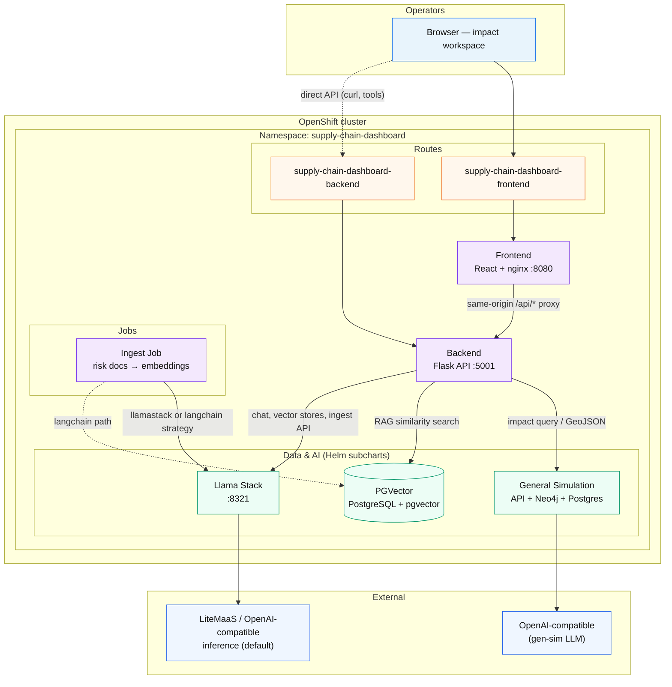
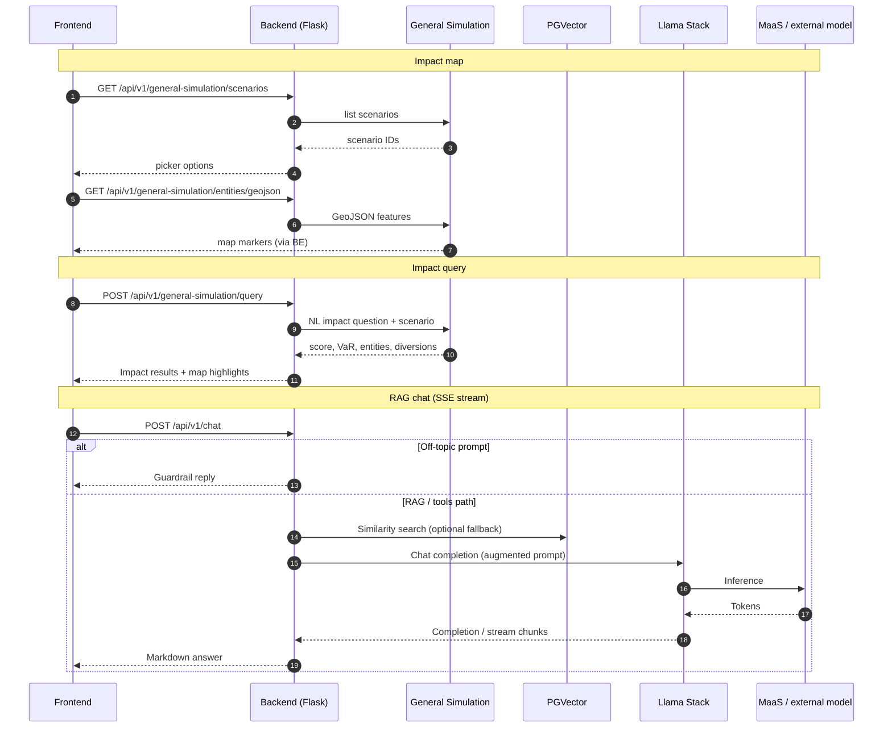

# AI Supply Chain Agent

An AI-powered supply chain intelligence dashboard that combines real-time logistics simulation with a Retrieval-Augmented Generation (RAG) chatbot to help operators monitor, analyze, and respond to global supply chain disruptions.

## Table of contents

- [Detailed description](#detailed-description)
- [Architecture diagrams](#architecture-diagrams)
- [Requirements](#requirements)
- [Deploy](#deploy)
  - [Option A: MaaS / external model (default)](#option-a-maas--external-model-default)
  - [Option B: Local CPU/GPU](#option-b-local-cpugpu)
- [References](#references)
- [Technical details](#technical-details)
- [Contributing](#contributing)
- [Tags](#tags)

## Detailed description

This quickstart deploys an interactive supply chain impact workspace backed by a Llama Stack LLM, a PGVector knowledge base, and a general-simulation impact engine. Operators run what-if scenarios (port strikes, airspace closures, Suez blockage), inspect affected entities and diversions on a map, and ask natural-language questions via a RAG chatbot grounded in curated risk documents.

For a longer product narrative (audience, problem statement, and demo scenario catalog), see [DETAILED_DESCRIPTION.md](DETAILED_DESCRIPTION.md).

Key capabilities:
- **Impact simulation**: Pick a seeded scenario, run a natural-language impact query, and review score, value at risk, affected entities, and recommended diversions on a Leaflet map.
- **RAG chatbot**: Streaming chat with per-scenario history; the UI auto-matches a Llama Stack vector store by scenario keywords.
- **Knowledge bases**: Upload `.txt`/`.md`/`.pdf` documents at runtime; a Helm post-install job also loads bundled risk analyses into Llama Stack vector stores (`ingest.strategy: llamastack`) or optionally PGVector (`langchain`).

### Architecture diagrams

The quickstart runs on OpenShift as a Helm umbrella chart (`supply-chain-dashboard`). Operators reach the impact workspace through a standalone Route. The Flask backend proxies general-simulation impact queries, RAG chat, and knowledge-base management; Llama Stack, PGVector, and the general-simulation subchart provide inference, retrieval, and spatial impact.

#### Deployment (OpenShift)



#### Impact simulation and RAG chat



## Requirements

### Minimum hardware requirements

| Resource | Minimum (MaaS default) | With local `llm-service` |
|----------|------------------------|---------------------------|
| GPU | Not required | 1× NVIDIA A10G (24 GB VRAM) or equivalent, or larger CPU nodes |
| CPU | 4 vCPU | 8+ vCPU |
| RAM | 16 GB | 32+ GB (CPU vLLM needs more) |
| Storage | 20 GB (PGVector + app) | 50 GB (model weights + PGVector) |

**Default:** `helm/values.yaml` uses LiteMaaS (`global.models.external-model`) and leaves `llm-service.enabled: false`, so no in-cluster model or GPU is required.

**Optional local model:** re-enable `llm-service` and a gated Hugging Face model (CPU or GPU). On AWS CPU mode, instances must support AVX-512 (tested on m6i). For GPU infrastructure in AWS see [AWS Setup](./infra/prereqs/ocp-gpu-setup/README.md).

### Minimum software requirements

| Component | Tested version |
|-----------|---------------|
| OpenShift | 4.21+ |
| OpenShift AI | 3.4+ |
| Helm | 3.14+ |
| Llama Stack | compatible with `llama-stack` subchart in `helm/` (from [ai-architecture-charts](https://github.com/rh-ai-quickstart/ai-architecture-charts)) |
| Python | 3.12 |
| Node.js | 22 (frontend builds) |
| `oc` CLI | Recommended for deploy status and troubleshooting |

### Required user permissions

**Application (backend, frontend, PGVector, Llama Stack)**

- Namespace **admin** role is sufficient to deploy the main Helm chart (it creates Routes, Deployments, Services, and a Job).

## Deploy

Defaults used below (overridable on `make`, e.g. `make helm-install NAMESPACE=my-ns`):

| Setting | Default |
|---------|---------|
| Helm chart | `./helm` |
| Release name | `supply-chain-dashboard` |
| Namespace | `supply-chain-dashboard` |
| Values file | `helm/values.yaml` |
| CI/CD Values File | `helm/values-kind.yaml` |

Run `make help` for the full target list.

For step 4, choose one of two deployment options:

- **[Option A](#option-a-maas--external-model-default)** — default. Llama Stack calls LiteMaaS (or another OpenAI-compatible endpoint). No local model pod. Requires an API token.
- **[Option B](#option-b-local-cpugpu)** — deploy an in-cluster LLM via `llm-service` (CPU or GPU). Requires a Hugging Face token for gated models.

General Simulation (optional subchart) uses its **own** OpenAI credentials (`api.llm` / `ingestion.llm` in secrets) — not LiteMaaS.

### 1. Clone the repository

```bash
git clone https://github.com/rh-ai-quickstart/ai-supply-chain-agent.git
cd ai-supply-chain-agent
```

### 2. Deploy secrets and values

**Required (Option A / default):** set your MaaS / LiteMaaS API token so Llama Stack can call `global.models.external-model`.

**Option A secrets — use `helm/secrets.yaml`** (recommended for local development):

```bash
cp helm/secrets.example.yaml helm/secrets.yaml
# Edit helm/secrets.yaml and set global.models.external-model.apiToken
```

Then deploy as usual — the Makefile automatically applies `helm/secrets.yaml` if it exists:

```bash
make helm-deps
make helm-install
```

**Option A secrets — pre-create / override at install** (token never needs to sit in a file):

```bash
helm upgrade --install supply-chain-dashboard ./helm \
  -f helm/values.yaml \
  --set global.models.external-model.apiToken="<your-maas-token>" \
  --namespace supply-chain-dashboard \
  --create-namespace \
  --wait \
  --timeout 10m
```

**Only when using Option B (local model):** also set a Hugging Face token so `llm-service` can pull gated weights (`llm-service.secret.hf_token` in `secrets.yaml`, or pre-create Secret `huggingface-secret` with key `HF_TOKEN`).

Everything else in `helm/values.yaml` works with the chart defaults (images, PGVector demo credentials, in-cluster API proxy, Llama Stack URLs). Override those only when you use a custom registry, namespace layout, or a local GPU model.

| Optional override | When you need it |
|-------------------|------------------|
| `backend.image.repository` / `tag`, `frontend.image.*`, `ingest.image.*` | Images built and pushed to your own registry (defaults: `quay.io/rh-ai-quickstart/...`) |
| `frontend.apiProxyUpstream` | Backend Service is not `http://<release>-backend:<port>` in the release namespace |
| `global.models.external-model.id` / `url` | Different MaaS model or endpoint (also drives `LLAMA_STACK_MODEL` / `LLAMA_STACK_OPENAI_MODEL` in the backend Deployment) |
| `backend.env.EMBED_MODEL` | Different embedding model ID |
| `backend.env.LLAMA_STACK_URL` | Release installed outside `supply-chain-dashboard` namespace (default URL is namespace-scoped) |
| `pgvector.secret.*` | Shared Postgres credentials for Llama Stack / backend (must match gen-sim Postgres password when `pgvector.enabled: false`) |
| `llm-service.enabled` + `device` / per-model `device` | Local inference instead of MaaS |
| `ingest.strategy` | `langchain` for PGVector ingest instead of default `llamastack` |
| `general-simulation.api.llm.*` | Gen-sim OpenAI endpoint / model overrides (`apiKey` in secrets) |
| `general-simulation.ingestion.enabled` | Keep `false` on AWS/hyperscaler clusters (OpenSky IP block); seed from laptop instead |
| `networkPolicy.egress.*` | Egress NetworkPolicy for default-deny namespaces (`enabled`/`allowAll`; does not fix OpenSky) |


### 3. Install Helm dependencies

```bash
helm dependency update ./helm
```

**Makefile alternative:**

```bash
make helm-deps
```

### 4. Deploy the application

#### Option A: MaaS / external model (default)

`helm/values.yaml` already enables `global.models.external-model` (LiteMaaS) and disables `llm-service`. After setting `global.models.external-model.apiToken` (step 2):

**Helm (install or upgrade):**

```bash
helm upgrade --install supply-chain-dashboard ./helm \
  -f helm/values.yaml \
  --namespace supply-chain-dashboard \
  --create-namespace \
  --wait \
  --timeout 10m
```

**Makefile alternatives** (use `VALUES_FILE=helm/my-values.yaml` when not using the default):

```bash
# First install (creates the OpenShift project if missing)
make helm-install VALUES_FILE=helm/values.yaml

# Subsequent upgrades
make helm-upgrade VALUES_FILE=helm/values.yaml

# Dry-run rendered manifests
make helm-render VALUES_FILE=helm/values.yaml

# Release status
make helm-status
```

The umbrella chart in `helm/` deploys:
- **Backend** — Flask API (port 5001), Route `supply-chain-dashboard-backend`
- **Frontend** — React SPA served by nginx (port 8080), Route `supply-chain-dashboard-frontend`
- **Shared Postgres** — gen-sim Postgres (AGE + pgvector + PostGIS); optional standalone `pgvector` subchart for agent-only installs
- **Llama Stack** — inference API (subchart); default provider is MaaS / external-model
- **General Simulation** — subchart enabled by default (Postgres + Neo4j + API; OpenAI LLM via secrets; not wired to MaaS). Live OpenSky CronJob is **off** by default.
- **Ingest Job** — optional post-install job (`ingest.enabled`) that loads the knowledge base
- **Egress NetworkPolicy** — optional (`networkPolicy.egress.enabled`) for namespaces that default-deny outbound traffic

To point at a non-default OpenAI-compatible endpoint (same pattern as `helm/gpu-values.yaml`):

```bash
helm upgrade --install supply-chain-dashboard ./helm \
  -f helm/values.yaml \
  --set global.models.external-model.id=<your-model-id> \
  --set global.models.external-model.url=https://<your-endpoint>/v1 \
  --set global.models.external-model.apiToken=<your-token> \
  --namespace supply-chain-dashboard \
  --create-namespace \
  --wait \
  --timeout 10m
```

Once deployed, continue from [step 5](#5-access-the-dashboard).

#### Option B: Local CPU/GPU

Re-enable the in-cluster model and disable MaaS, for example:

```yaml
# overrides or edit values.yaml
global:
  models:
    llama-3-2-3b-instruct:
      enabled: true
    external-model:
      enabled: false
llm-service:
  enabled: true
  models:
    llama-3-2-3b-instruct:
      enabled: true
```

`LLAMA_STACK_MODEL` is derived from `global.models` by the backend Deployment template (no `backend.env.LLAMA_STACK_MODEL` override).

Set `llm-service.secret.hf_token` (or Secret `huggingface-secret`), then install with the same `helm upgrade --install` / `make helm-install` commands as Option A. Use `llm-service.device: gpu` (and matching per-model `device`) when GPUs are available.

Once deployed, continue from [step 5](#5-access-the-dashboard).
### 5. Access the dashboard

**See detailed walkthrough [here](/docs/WHAT_TO_EXPECT.md)**

After pods are ready:

```bash
oc get route supply-chain-dashboard-frontend -n supply-chain-dashboard -o jsonpath='https://{.spec.host}{"\n"}'
```

**Makefile alternative:**

```bash
make oc-status
```

Open the frontend Route URL in your browser. See [What to expect after deployment](./docs/WHAT_TO_EXPECT.md) for the Simulation / Knowledge bases / Create scenario walkthrough.

**Seed general-simulation map data** (required for scenarios and markers). Gen-sim’s in-cluster OpenSky job is disabled by default — OpenSky often blocks hyperscaler IPs. From a laptop with `oc` login and a sibling [general-simulation](https://github.com/robertsandoval/general-simulation) checkout:

```bash
make seed-gen-sim
# optional denser live aircraft (OpenSky pulled on your laptop → cluster DBs)
make seed-opensky-live GEN_SIM_NAMESPACE=supply-chain-dashboard
# or: make seed
```

**Optional — re-run knowledge-base ingestion without a full Helm upgrade:**

```bash
make ingest
make ingest-status
make ingest-logs
```

### 6. (Optional) Build and push images

Build all application images:

```bash
make build
```

Or build and push in one step (after `make login` to your registry):

```bash
make release REGISTRY=quay.io/<your-org>
```

Individual images:

```bash
make build-backend build-ingest build-frontend
make push-backend push-ingest push-frontend
```

Override tags or registry as needed, e.g. `make build-backend BACKEND_TAG=v1 REGISTRY=quay.io/myorg`.

### Delete

**Application — Helm:**

```bash
helm uninstall supply-chain-dashboard --namespace supply-chain-dashboard
oc delete project supply-chain-dashboard
```

**Makefile alternative:**

```bash
make helm-uninstall
oc delete project supply-chain-dashboard
```

## References

- [What to expect after deployment?](./docs/WHAT_TO_EXPECT.md)
- [Llama Stack documentation](https://llama-stack.readthedocs.io)
- [LangChain PGVector integration](https://python.langchain.com/docs/integrations/vectorstores/pgvector/)
- [React Leaflet](https://react-leaflet.js.org/)
- [OpenShift AI documentation](https://docs.redhat.com/en/documentation/red_hat_openshift_ai_self-managed)

## Technical details

### Repository layout

```
app/
├── backend/
│   ├── api/                        # Python Flask API (runtime image)
│   │   ├── main.py                 # App entry point
│   │   ├── app_factory.py          # Flask app + blueprint registration
│   │   ├── requirements.txt
│   │   ├── Containerfile
│   │   ├── clients/                # Llama Stack, PGVector, gen-sim, OpenSky, news
│   │   ├── routes/                 # HTTP blueprints (chat, gen-sim, KB, …)
│   │   ├── services/               # Chat, impact proxy, scenario create, RAG
│   │   └── repositories/           # JSON file stores for KB / simulations catalog
│   └── ingestion/                  # Knowledge-base ingestion CLI (ingest image)
│       ├── main.py
│       ├── config.py
│       ├── loaders/document_loader.py
│       ├── services/ingestion_service.py
│       ├── services/llamastack_ingestion_service.py
│       └── knowledge_base/         # Bundled .txt risk documents
└── frontend/              # React + Vite SPA
    ├── index.html
    ├── package.json
    ├── vite.config.js
    ├── Containerfile
    └── src/
        ├── App.jsx
        ├── components/    # ImpactSimulationPage, ImpactMapPanel,
        │                  # ImpactQueryPanel, ImpactResultsPanel, ChatBar,
        │                  # KnowledgeBasesPage, CreateScenarioPage, NewsTicker
        ├── hooks/         # useImpactSimulation, useChatSession, useHashRoute, …
        └── services/      # apiClient, generalSimulationService, …
scripts/
├── seed-gen-sim-demo.sh   # Laptop → cluster Neo4j+Postgres demo seed
└── seed-opensky-live.sh   # Laptop OpenSky pull → cluster DBs
```

### Backend API

| Method | Path | Description |
|--------|------|-------------|
| `GET` | `/healthz` | Liveness probe |
| `GET` | `/readyz` | Readiness (dependency checks) |
| `GET` | `/api/v1/version` | Build metadata |
| `GET` | `/api/v1/general-simulation/scenarios` | Scenario IDs for the impact picker |
| `POST` | `/api/v1/general-simulation/query` | Natural-language impact query |
| `GET` | `/api/v1/general-simulation/entities/geojson` | Map entity GeoJSON |
| `POST` | `/api/v1/chat` | RAG-augmented chat (SSE when `stream: true`) |
| `GET` | `/api/v1/vector_stores` | List Llama Stack vector stores (chat picker) |
| `GET` / `POST` | `/api/v1/knowledge-bases` | List or upload UI-managed knowledge bases |
| `POST` | `/api/v1/scenarios/propose` | Propose a scenario draft from NL |
| `POST` | `/api/v1/scenarios` | Create a scenario in general-simulation |
| `GET` | `/api/v1/news` | RSS headlines for the news ticker |

### Environment variables

**Helm (`helm/secrets.yaml`)** — for the default MaaS path, set `global.models.external-model.apiToken` to a literal token (copy from `secrets.example.yaml`). Do not use `${env.VAR}` — the llama-stack init script will hit bash `bad substitution`. A Hugging Face token (`llm-service.secret.hf_token` or Secret `huggingface-secret` / `HF_TOKEN`) is only required when you re-enable local `llm-service`. Other keys below are set by the chart or optional overrides.

**Backend**

| Variable | Description | Default |
|----------|-------------|---------|
| `LLAMA_STACK_URL` | Llama Stack base URL | — |
| `LLAMA_STACK_MODEL` | Model identifier | — |
| `EMBED_MODEL` | Embedding model identifier | — |
| `PG_HOST` | PostgreSQL host | — |
| `PG_PORT` | PostgreSQL port | `5432` |
| `PG_USER` | PostgreSQL user | — |
| `PG_PASSWORD` | PostgreSQL password | — |
| `PG_DB` | PostgreSQL database name | — |
| `GENERAL_SIMULATION_BASE_URL` | General-simulation API base URL | `http://general-sim-api:8000` (chart) |
| `NEWS_FEED_URLS` | Optional custom RSS feeds (`Name\|url` pairs) | empty → BBC/Guardian defaults |

**Ingestion job (additional)**

| Variable | Description | Default |
|----------|-------------|---------|
| `INGEST_STRATEGY` | `llamastack` (server-side) or `langchain` (PGVector) | `llamastack` (chart default) |
| `KNOWLEDGE_BASE_DIR` | Path to `.txt` source documents | `knowledge_base` |
| `INGEST_CHUNK_SIZE` | Chunk size (`langchain` strategy only) | `1000` |
| `INGEST_CHUNK_OVERLAP` | Chunk overlap (`langchain` strategy only) | `200` |
| `INGEST_DROP_OLD` | Drop existing collection before ingestion (`langchain` only) | `true` |
| `INGEST_GLOB` | Glob pattern for source files | `**/*.txt` |

**Frontend**

| Variable | Description | Default |
|----------|-------------|---------|
| `BACKEND_UPSTREAM` | nginx `/api` proxy target (set on the frontend pod at runtime) | `http://<release>-backend:5001` |
| `VITE_DEV_API_PROXY_TARGET` | Local `pnpm dev` proxy target for `/api` | `http://127.0.0.1:5001` |

### Frontend dependencies

- **React 19** + **Vite 7** + **pnpm**
- **Leaflet 1.9** + `react-leaflet 5` — impact map
- **react-markdown** — streaming chat / impact answers

### Backend dependencies

- **Flask** + `flask-cors`
- **openai** — Llama Stack OpenAI-compatible client
- **LangChain** (`langchain`, `langchain-community`, `langchain-text-splitters`, `langchain-openai`, `langchain-postgres`) — document loading, splitting, embedding, PGVector integration
- **psycopg[binary]** — PostgreSQL driver

## Contributing

See [CONTRIBUTING.md](CONTRIBUTING.md) for prerequisites, local setup, and the quality gate (`make lint`, `make test`, `make pre-commit`, `make helm-test`). Remaining optional polish lives in [suggestions.md](suggestions.md); completed cleanup is summarized in [tech_debt.md](tech_debt.md).

## Tags

- **Title**: AI Supply Chain Agent
- **Description**: AI-powered supply chain impact simulation with RAG chatbot and knowledge-base management on OpenShift AI.
- **Industry**: Manufacturing / Logistics
- **Product**: OpenShift AI, OpenShift
- **Use case**: AI agents, RAG, supply chain intelligence
- **Contributor org**: Red Hat
