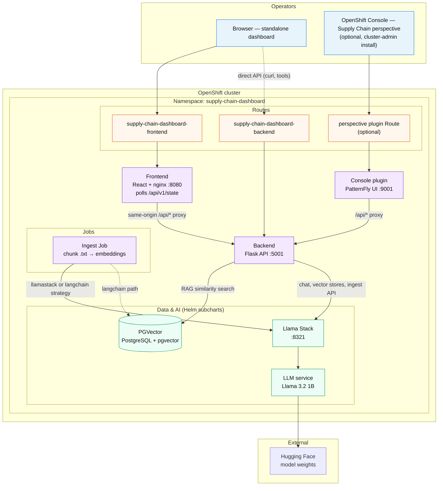
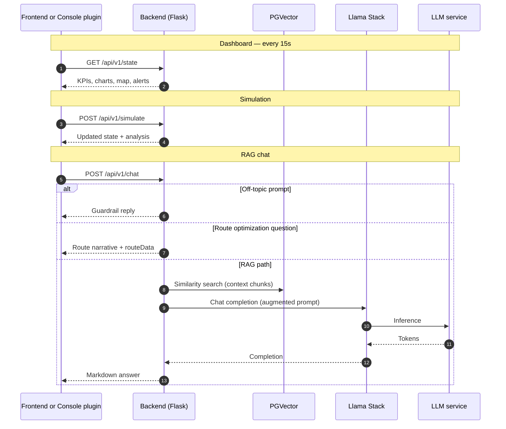

# AI Supply Chain Agent

An AI-powered supply chain intelligence dashboard that combines real-time logistics simulation with a Retrieval-Augmented Generation (RAG) chatbot to help operators monitor, analyze, and respond to global supply chain disruptions.

## Table of contents

- [Detailed description](#detailed-description)
- [Architecture diagrams](#architecture-diagrams)
- [Requirements](#requirements)
- [Deploy](#deploy)
  - [Option A: Local CPU/GPU](#option-a-local-cpugpu)
  - [Option B: External GPU model](#option-b-external-gpu-model)
- [References](#references)
- [Technical details](#technical-details)
- [Tags](#tags)

## Detailed description

This quickstart deploys an interactive supply chain operations dashboard backed by a Llama Stack LLM and a PGVector knowledge base. Operators can monitor KPIs (inventory levels, revenue, route efficiency), trigger simulated disruption scenarios (port strikes, geopolitical events), and ask natural-language questions via a built-in RAG chatbot that draws on a curated supply-chain risk knowledge base.

Key capabilities:
- **Live dashboard**: KPI bar, demand and revenue charts, a Leaflet logistics map (global / regional / air-freight views), system health metrics, and an alerts panel — all refreshed every 15 seconds.
- **Scenario simulation**: Select a disruption scenario (e.g. port strike, geopolitical tension) and optionally enable route optimization; the backend updates dashboard state and returns an AI-generated analysis.
- **RAG chatbot**: A chat sidebar sends questions to a Flask API that retrieves context from PGVector (default) or a selected Llama Stack vector store, builds a context-augmented prompt, and calls the Llama Stack LLM.
- **Ingestion pipeline**: A Helm post-install job loads bundled `.txt` knowledge-base documents into Llama Stack vector stores by default (`ingest.strategy: llamastack`); optional `langchain` strategy chunks and embeds into PGVector instead.
- **OpenShift Console perspective** (optional): A dynamic console plugin in `app/supply-chain-perspective/` adds a dedicated **Supply Chain** perspective in the OpenShift web console with the same dashboard, simulations, and knowledge-base workflows integrated into the cluster UI.

### Architecture diagrams

The quickstart runs on OpenShift as a Helm umbrella chart (`supply-chain-dashboard`). Operators reach the dashboard through a standalone Route or, optionally, the OpenShift Console **Supply Chain** perspective. The Flask backend drives UI state, simulations, and RAG chat; Llama Stack and PGVector provide inference and retrieval.

#### Deployment (OpenShift)



#### RAG chat and dashboard refresh



## Requirements

### Minimum hardware requirements

| Resource | Minimum |
|----------|---------|
| GPU | 1× NVIDIA A10G (24 GB VRAM) or equivalent for LLM inference |
| CPU | 8 vCPU |
| RAM | 32 GB |
| Storage | 50 GB (model weights + PGVector data) |

**Important:** The app can be deployed on clusters without a GPU and run the LLM in CPU mode. This is the default set up in helm/values.yaml  
**Important:** If deploying this in AWS in CPU Mode: Instances must support AVX-512 instruction set. Testing was done using m6i instance types.  

For setting up GPU infrastructure in AWS please see [AWS Setup](./infra/prereqs/ocp-gpu-setup/README.md)  

### Minimum software requirements

| Component | Tested version |
|-----------|---------------|
| OpenShift | 4.21+ |
| OpenShift AI | 3.4+ |
| Helm | 3.14+ |
| Llama Stack | compatible with `llama-stack` subchart in `helm/` (from [ai-architecture-charts](https://github.com/rh-ai-quickstart/ai-architecture-charts)) |
| Python | 3.12 |
| Node.js | 22 (frontend and perspective plugin builds) |
| Yarn | 4.13+ (perspective plugin build; see `packageManager` in `app/supply-chain-perspective/package.json`) |
| OpenShift Console | 4.12+ cluster with dynamic plugins enabled (`ConsolePlugin` CRD v1) |
| `oc` CLI | Required to install the perspective Helm chart and patch the console operator |

The perspective plugin image is built for **linux/amd64** (see `app/supply-chain-perspective/Containerfile`). At runtime it expects the **backend API** from the main Helm deployment (or a build-time override via `SUPPLY_CHAIN_API_BASE_URL`).

### Required user permissions

**Application (backend, frontend, PGVector, Llama Stack)**

- Namespace **admin** role is sufficient to deploy the main Helm chart (it creates Routes, Deployments, Services, and a Job).

**OpenShift Console perspective** (`app/supply-chain-perspective/`)

- **Cluster-admin is required.** Installing the perspective registers a `ConsolePlugin` custom resource and enables the plugin in the cluster-wide `consoles.operator.openshift.io` configuration. Namespace-scoped admin is not sufficient.
- After installation, any user who can access the OpenShift Console can use the Supply Chain perspective (subject to your console RBAC).

## Deploy

Defaults used below (overridable on `make`, e.g. `make helm-install NAMESPACE=my-ns`):

| Setting | Default |
|---------|---------|
| Helm chart | `./helm` |
| Release name | `supply-chain-dashboard` |
| Namespace | `supply-chain-dashboard` |
| Values file | `helm/values.yaml` |
| CI/CD Values File | `helm/values-kind.yaml` |

Run `make help` for the full target list.

For step 4, choose one of two deployment options:

- **[Option A](#option-a-local-cpugpu)** — deploy with a local LLM (CPU or GPU via KServe). Requires a Hugging Face token.
- **[Option B](#option-b-external-gpu-model)** — point the quickstart at an external vLLM-compatible endpoint. No local model deployment required.

### 1. Clone the repository

```bash
git clone https://github.com/rh-ai-quickstart/ai-supply-chain-agent.git
cd ai-supply-chain-agent
```

### 2. Edit values

**Only required change:** set your Hugging Face token in `helm/values.yaml` so the `llm-service` sub-chart can pull gated models (for example `meta-llama/Llama-3.2-1B-Instruct`):

```yaml
llm-service:
  secret:
    hf_token: "<your-hf-token>"
```

Create a token at [huggingface.co/settings/tokens](https://huggingface.co/settings/tokens) with read access to the models you use.

Everything else in `helm/values.yaml` works with the chart defaults (images, PGVector demo credentials, in-cluster API proxy, Llama Stack URLs). Override those only when you use a custom registry, namespace layout, or GPU settings.

| Optional override | When you need it |
|-------------------|------------------|
| `backend.image.repository` / `tag`, `frontend.image.*`, `ingest.image.*` | Images built and pushed to your own registry (defaults: `quay.io/rh-ai-quickstart/...`) |
| `frontend.apiProxyUpstream` | Backend Service is not `http://<release>-backend:<port>` in the release namespace |
| `backend.env.LLAMA_STACK_MODEL` / `EMBED_MODEL` | Different model or embedding IDs |
| `backend.env.LLAMA_STACK_URL` | Release installed outside `supply-chain-dashboard` namespace (default URL is namespace-scoped) |
| `pgvector.secret.*` | Non-demo database credentials |
| `llm-service.device` / `llm-service.models.<model-name>.device` | GPU inference instead of CPU |
| `ingest.strategy` | `langchain` for PGVector ingest instead of default `llamastack` |


### 3. Install Helm dependencies

```bash
helm dependency update ./helm
```

**Makefile alternative:**

```bash
make helm-deps
```

### 4. Deploy the application

#### Option A: Local CPU/GPU

**Helm (install or upgrade):**

```bash
helm upgrade --install supply-chain-dashboard ./helm \
  -f helm/values.yaml \
  --namespace supply-chain-dashboard \
  --create-namespace \
  --wait \
  --timeout 10m
```

**Makefile alternatives** (use `VALUES_FILE=helm/my-values.yaml` when not using the default):

```bash
# First install (creates the OpenShift project if missing)
make helm-install VALUES_FILE=helm/values.yaml

# Subsequent upgrades
make helm-upgrade VALUES_FILE=helm/values.yaml

# Dry-run rendered manifests
make helm-render VALUES_FILE=helm/values.yaml

# Release status
make helm-status
```

The umbrella chart in `helm/` deploys:
- **Backend** — Flask API (port 5001), Route `supply-chain-dashboard-backend`
- **Frontend** — React SPA served by nginx (port 8080), Route `supply-chain-dashboard-frontend`
- **PGVector** — PostgreSQL + pgvector (subchart)
- **Llama Stack** + **LLM service** — inference (subcharts)
- **Ingest Job** — optional post-install job (`ingest.enabled`) that loads the knowledge base

#### Option B: External GPU model

If you have an external vLLM-compatible inference endpoint (for example, a model already deployed on a GPU cluster or a managed inference service), you can point the quickstart at it instead of deploying a local LLM service.

Use `helm/gpu-values.yaml` as your values file.

**Helm (install or upgrade):**

```bash
helm upgrade --install supply-chain-dashboard ./helm \
  -f helm/gpu-values.yaml \
  --set global.models.external-model.id=<your-model-id> \
  --set global.models.external-model.url=https://<your-endpoint>/v1 \
  --set global.models.external-model.apiToken=<your-token> \
  --set llama-stack.secrets.EXTERNAL_MODEL_API_TOKEN=<your-token> \
  --set backend.env.LLAMA_STACK_MODEL=external-model/<your-model-id> \
  --namespace supply-chain-dashboard \
  --create-namespace \
  --wait \
  --timeout 10m
```

Replace:
- `<your-model-id>` — the model ID as served by your endpoint (e.g. `meta-llama/Llama-3.1-8B-Instruct`)
- `https://<your-endpoint>/v1` — the base URL of your vLLM-compatible inference endpoint
- `<your-token>` — your API token; passed twice: once as `apiToken` for the init container health check, and once into the `llama-stack-env` Secret for LlamaStack runtime use

Once deployed, continue from [step 5](#5-access-the-dashboard).

### 5. Access the dashboard

**See detailed walkthrough [here](/docs/WHAT_TO_EXPECT.md)**

After pods are ready:

```bash
oc get route supply-chain-dashboard-frontend -n supply-chain-dashboard -o jsonpath='https://{.spec.host}{"\n"}'
```

**Makefile alternative:**

```bash
make oc-status
```

Open the frontend Route URL in your browser.

**Optional — re-run ingestion without a full Helm upgrade:**

```bash
make ingest
make ingest-status
make ingest-logs
```

### 6. (Optional) Deploy the OpenShift Console perspective

The Supply Chain perspective is a separate console dynamic plugin. It requires **cluster-admin** to install because the Helm chart creates a `ConsolePlugin` and patches the console operator to enable the plugin cluster-wide.

By default the plugin chart proxies `/api/` to the backend Service `supply-chain-dashboard-backend` in the same namespace as the main release.

**Build and push the plugin image** (from the repo root):

```bash
make build-perspective push-perspective
```

**Makefile alternative** (build + push):

```bash
make release-perspective REGISTRY=quay.io/<your-org>
```

If the API is not reached via the console same-origin proxy, bake in a full backend origin at build time:

```bash
make build-perspective PERSPECTIVE_API_BASE_URL=https://supply-chain-dashboard-backend-supply-chain-dashboard.apps.<cluster>.<domain>
```

**Helm** (typically the same namespace as the dashboard so the API proxy resolves):

```bash
helm upgrade --install supply-chain-perspective \
  ./app/supply-chain-perspective/charts/openshift-console-plugin \
  --namespace supply-chain-dashboard \
  --create-namespace \
  --set plugin.image=quay.io/rh-ai-quickstart/ai-supply-chain-agent-perspective:latest
```

In the OpenShift Console, select the **Supply Chain** perspective. See `app/supply-chain-perspective/README.md` for local console development.

### 7. (Optional) Build and push images

Build all application images:

```bash
make build
```

Or build and push in one step (after `make login` to your registry):

```bash
make release REGISTRY=quay.io/<your-org>
```

Individual images:

```bash
make build-backend build-ingest build-frontend
make push-backend push-ingest push-frontend
```

Override tags or registry as needed, e.g. `make build-backend BACKEND_TAG=v1 REGISTRY=quay.io/myorg`.

### Delete

**Application — Helm:**

```bash
helm uninstall supply-chain-dashboard --namespace supply-chain-dashboard
oc delete project supply-chain-dashboard
```

**Makefile alternative:**

```bash
make helm-uninstall
oc delete project supply-chain-dashboard
```

**Perspective plugin (if installed):**

```bash
helm uninstall supply-chain-perspective --namespace supply-chain-dashboard
```

## References

- [What to expect after deployment?](./docs/WHAT_TO_EXPECT.md)
- [Llama Stack documentation](https://llama-stack.readthedocs.io)
- [LangChain PGVector integration](https://python.langchain.com/docs/integrations/vectorstores/pgvector/)
- [React Leaflet](https://react-leaflet.js.org/)
- [Chart.js](https://www.chartjs.org/)
- [OpenShift AI documentation](https://docs.redhat.com/en/documentation/red_hat_openshift_ai_self-managed)

## Technical details

### Repository layout

```
app/
├── supply-chain-perspective/   # OpenShift Console dynamic plugin (Supply Chain perspective)
│   ├── charts/openshift-console-plugin/   # Helm chart (ConsolePlugin + operator patch)
│   ├── src/components/         # Dashboard, simulations, knowledge bases UI
│   └── Containerfile           # Plugin image build
├── backend/
│   ├── api/                        # Python Flask API (runtime image)
│   │   ├── main.py                 # App entry point and route definitions
│   │   ├── requirements.txt
│   │   ├── Containerfile
│   │   ├── clients/
│   │   │   ├── llama_stack_client.py   # OpenAI-compatible LLM client
│   │   │   ├── vector_store_client.py  # PGVector / LangChain client
│   │   │   └── opensky_client.py       # Live aircraft positions (map)
│   │   └── services/
│   │       ├── chat_service.py         # RAG pipeline + guardrails
│   │       ├── dashboard_service.py    # KPI / alert / chart state
│   │       ├── route_service.py        # Route optimization logic
│   │       ├── knowledge_base_ingest_service.py
│   │       ├── knowledge_bases_store.py
│   │       └── simulations_store.py
│   └── ingestion/                  # Knowledge-base ingestion CLI (ingest image)
│       ├── main.py
│       ├── config.py
│       ├── loaders/document_loader.py
│       ├── services/ingestion_service.py
│       ├── services/llamastack_ingestion_service.py
│       └── knowledge_base/         # .txt source documents
└── frontend/              # React + Vite SPA
    ├── index.html
    ├── package.json
    ├── vite.config.js
    ├── Containerfile
    └── src/
        ├── App.jsx
        ├── components/    # AlertsPanel, ChatBar, DashboardHeader,
        │                  # DemandChartPanel, KpiBar, LogisticsMapPanel,
        │                  # RevenueChartPanel, SimulationPanel, SystemHealthPanel
        ├── hooks/
        │   └── useDashboardState.js   # Polls /api/v1/state every 15 s
        └── services/
            ├── apiClient.js           # same-origin fetch to /api/... (nginx or Vite proxy)
            ├── dashboardService.js    # API call helpers
            └── dashboardMappers.js    # Backend state → UI data shapes
```

### Backend API

| Method | Path | Description |
|--------|------|-------------|
| `GET` | `/healthz` | Liveness probe |
| `GET` | `/api/v1/state` | Full dashboard state (KPIs, alerts, charts, map) |
| `POST` | `/api/v1/trigger-event` | Trigger a disruption event for a given map view |
| `POST` | `/api/v1/simulate` | Run a named scenario with optional route optimization |
| `POST` | `/api/v1/chat` | RAG-augmented chat with the LLM |
| `GET` | `/api/v1/vector_stores` | List Llama Stack vector stores (chat picker) |
| `GET` / `POST` | `/api/v1/knowledge-bases` | List or upload UI-managed knowledge bases |
| `GET` / `POST` | `/api/v1/simulations` | List or create named simulation records (perspective) |

### Environment variables

**Helm (`helm/values.yaml`)** — the only value you must set before deploy is `llm-service.secret.hf_token` (Hugging Face token for gated models). Other keys below are set by the chart or optional overrides.

**Backend**

| Variable | Description | Default |
|----------|-------------|---------|
| `LLAMA_STACK_URL` | Llama Stack base URL | — |
| `LLAMA_STACK_MODEL` | Model identifier | — |
| `EMBED_MODEL` | Embedding model identifier | — |
| `PG_HOST` | PostgreSQL host | — |
| `PG_PORT` | PostgreSQL port | `5432` |
| `PG_USER` | PostgreSQL user | — |
| `PG_PASSWORD` | PostgreSQL password | — |
| `PG_DB` | PostgreSQL database name | — |

**Ingestion job (additional)**

| Variable | Description | Default |
|----------|-------------|---------|
| `INGEST_STRATEGY` | `llamastack` (server-side) or `langchain` (PGVector) | `llamastack` (chart default) |
| `KNOWLEDGE_BASE_DIR` | Path to `.txt` source documents | `knowledge_base` |
| `INGEST_CHUNK_SIZE` | Chunk size (`langchain` strategy only) | `1000` |
| `INGEST_CHUNK_OVERLAP` | Chunk overlap (`langchain` strategy only) | `200` |
| `INGEST_DROP_OLD` | Drop existing collection before ingestion (`langchain` only) | `true` |
| `INGEST_GLOB` | Glob pattern for source files | `**/*.txt` |

**Frontend**

| Variable | Description | Default |
|----------|-------------|---------|
| `BACKEND_UPSTREAM` | nginx `/api` proxy target (set on the frontend pod at runtime) | `http://<release>-backend:5001` |
| `VITE_DEV_API_PROXY_TARGET` | Local `npm run dev` proxy target for `/api` | `http://127.0.0.1:5001` |

**Perspective plugin (build-time)**

| Variable | Description | Default |
|----------|-------------|---------|
| `SUPPLY_CHAIN_API_BASE_URL` | Full backend origin baked into the plugin bundle (`make` passes `PERSPECTIVE_API_BASE_URL`) | *(empty — use console plugin proxy at `/api/plugins/supply-chain-perspective/`)* |
| `SUPPLY_CHAIN_DEV_API_PROXY_TARGET` | Local `yarn start` webpack dev proxy target | `http://127.0.0.1:5001` |

### Frontend dependencies

- **React 19** + **Vite 7**
- **Chart.js 4** + `react-chartjs-2` — demand and revenue charts
- **Leaflet 1.9** + `react-leaflet 5` — logistics map

### Backend dependencies

- **Flask** + `flask-cors`
- **openai** — Llama Stack OpenAI-compatible client
- **LangChain** (`langchain`, `langchain-community`, `langchain-text-splitters`, `langchain-openai`, `langchain-postgres`) — document loading, splitting, embedding, PGVector integration
- **psycopg[binary]** — PostgreSQL driver

### Perspective dependencies

Build and runtime tooling (`app/supply-chain-perspective/`):

- **Node.js 22** + **Yarn 4.13** — plugin bundle build (`yarn build` / `make build-perspective`)
- **TypeScript 5** + **Webpack 5** — production bundle and module federation
- **UBI 9** `nodejs-22` and `nginx-120` images — multi-stage `Containerfile` (plugin served on port **9001** with OpenShift service CA TLS)

Console and UI (aligned with OpenShift Console **4.21** dynamic plugin SDK):

- **React 17** + **react-dom 17** — required by `@openshift-console/dynamic-plugin-sdk`
- **@openshift-console/dynamic-plugin-sdk** `4.21-latest` + **@openshift-console/dynamic-plugin-sdk-webpack** — console plugin API and webpack integration
- **@console/pluginAPI** `^4.21.0` — declared console plugin dependency in `package.json`
- **PatternFly 6** (`@patternfly/react-core`, `react-icons`, `react-table`) — console-consistent UI
- **react-router-dom** 5.3.x + **react-router-dom-v5-compat** — routing inside the perspective
- **react-i18next** + **i18next** — translations (`plugin__supply-chain-perspective` namespace)

Dashboard features (shared with the standalone frontend):

- **Chart.js 4** + **react-chartjs-2** — demand and revenue charts
- **Leaflet 1.9** + **react-leaflet 3** — logistics map
- **react-markdown** — RAG chat responses in the dashboard

Runtime dependency:

- **Backend API** — same Flask endpoints as the main application (`/api/v1/state`, `/api/v1/simulate`, `/api/v1/chat`, etc.)

## Tags

- **Title**: AI Supply Chain Agent
- **Description**: AI-powered supply chain dashboard with RAG chatbot, disruption simulation, and real-time logistics monitoring on OpenShift AI.
- **Industry**: Manufacturing / Logistics
- **Product**: OpenShift AI, OpenShift
- **Use case**: AI agents, RAG, supply chain intelligence
- **Contributor org**: Red Hat
