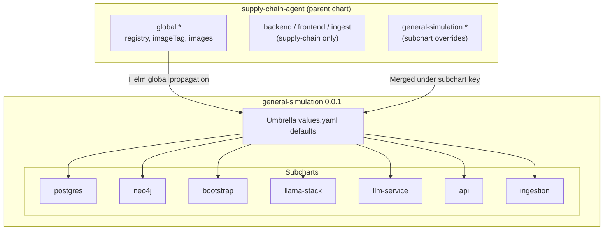
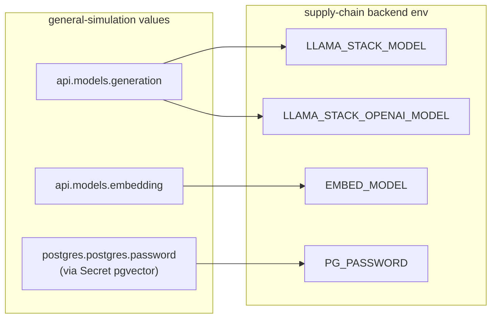
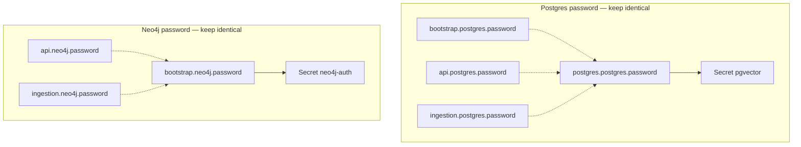
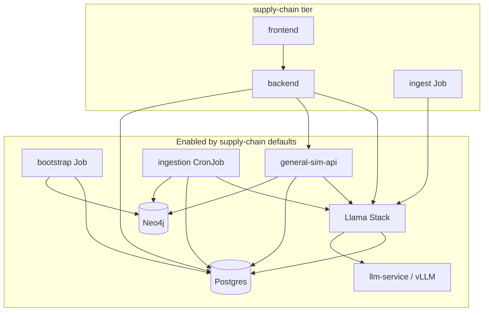

# general-simulation subchart values mapping

Reference for consumers of the **general-simulation** Helm subchart when it is installed via the **supply-chain-agent** umbrella chart (`helm/`).

This document maps every value defined in [general-simulation `values.yaml`](https://github.com/robertsandoval/general-simulation/blob/main/deploy/helm/general-simulation/values.yaml) (chart **0.0.1**) to how it is set—or left at its default—when deploying supply-chain. Use it to understand what to override, where credentials must stay in sync, and how supply-chain app pods read gen-sim configuration.

---

## How values flow

Helm installs supply-chain as the **parent** release. The `general-simulation` dependency is a **subchart**. Values reach gen-sim in two ways:



### Override path convention

| Where you edit | Helm `--set` prefix | Applies to |
|----------------|---------------------|------------|
| Parent `global` | `global.` | Supply-chain images **and** gen-sim images (registry/tag) |
| Subchart block | `general-simulation.` | Gen-sim platform only |
| Supply-chain app | `backend.`, `frontend.`, `ingest.` | Dashboard tier only |

**Example:** change the Postgres password for the whole platform:

```bash
helm upgrade --install supply-chain-dashboard ./helm \
  --set general-simulation.postgres.postgres.password='new-secret' \
  --set general-simulation.api.postgres.password='new-secret' \
  --set general-simulation.bootstrap.postgres.password='new-secret' \
  --set general-simulation.ingestion.postgres.password='new-secret'
```

---

## Supply-chain reads from gen-sim

The supply-chain **backend** does not duplicate model selection. It reads gen-sim values at render time:



| Backend env var | Source | Supply-chain override? |
|-----------------|--------|------------------------|
| `LLAMA_STACK_MODEL` | `general-simulation.api.models.generation` | No — set on gen-sim only |
| `LLAMA_STACK_OPENAI_MODEL` | same as above | No |
| `EMBED_MODEL` | `general-simulation.api.models.embedding` | Optional: `backend.env.EMBED_MODEL` |
| `LLAMA_STACK_URL` | `backend.env.LLAMA_STACK_URL` | Yes (`backend.env`) |
| `GENERAL_SIMULATION_BASE_URL` | `backend.env.GENERAL_SIMULATION_BASE_URL` | Yes |
| `PG_HOST` / `PG_USER` / `PG_DB` | `backend.env.*` | Yes (must match gen-sim Postgres) |
| `PG_PASSWORD` | Secret `pgvector` (created by gen-sim) | Indirect — sync postgres passwords |

---

## Parent `global` values (affect gen-sim images)

These live at the **top level** of `helm/values.yaml`, not under `general-simulation:`. Helm propagates `global` to all subcharts.

| Path | Gen-sim default | Supply-chain `values.yaml` | Effective via supply-chain |
|------|-----------------|----------------------------|----------------------------|
| `global.registry` | `quay.io/rh-ai-quickstart` | `quay.io/rh-ai-quickstart` | Parent value (same) |
| `global.imageTag` | `latest` | `latest` | Parent value (same) |
| `global.images.app` | `general-sim-api` | `general-sim-api` | Parent value (same) |
| `global.images.postgres` | `general-sim-postgres` | `general-sim-postgres` | Parent value (same) |

Supply-chain also defines `global.images.backend`, `frontend`, and `ingest` for its own tier; gen-sim ignores those keys.

**Override example:**

```bash
--set global.registry=quay.io/my-org --set global.imageTag=v1.2.3
```

---

## `openshift` — OpenShift-only resources

| Path | Gen-sim default | Supply-chain override | Effective |
|------|-----------------|----------------------|-----------|
| `openshift.neo4j.scc.enabled` | `true` | `true` | `true` |

When `true`, gen-sim creates Neo4j ServiceAccount + `anyuid` SCC binding. Set to `false` on Kind / plain Kubernetes (`helm/values-kind.yaml` does this).

---

## `global.models` — Llama Stack inference providers

Provider **keys** must be DNS-safe (no slashes). They become InferenceService / Service names (`<key>-vllm`). The Hugging Face or API model id goes in `id:`.

Stack model ids used by the API follow `<providerKey>/<model.id>` (see `api.models.generation`).

| Path | Gen-sim default | Supply-chain override | Effective |
|------|-----------------|----------------------|-----------|
| `global.models.openai.enabled` | `true` | `false` | **`false`** |
| `global.models.openai.id` | `gpt-4o-mini` | — | `gpt-4o-mini` |
| `global.models.openai.url` | `https://api.openai.com/v1` | — | `https://api.openai.com/v1` |
| `global.models.openai.apiToken` | `""` | — | `""` (set in secrets for OpenAI mode) |
| `global.models.deepseek-r1-distill-qwen-1-5b.enabled` | `false` | `true` | **`true`** |
| `global.models.deepseek-r1-distill-qwen-1-5b.id` | `deepseek-ai/DeepSeek-R1-Distill-Qwen-1.5B` | same | same |
| `global.models.deepseek-r1-distill-qwen-1-5b.apiToken` | `unused` | `unused` | `unused` |
| `global.models.external-model.enabled` | *(not in gen-sim defaults)* | `false` | `false` |
| `global.models.external-model.id` | — | `Qwen3.6-35B-A3B` | `Qwen3.6-35B-A3B` |
| `global.models.external-model.url` | — | `https://litemaas.rhoai.rh-aiservices-bu.com/v1` | same |
| `global.models.external-model.apiToken` | — | `""` | Set in `helm/secrets.yaml` for MaaS mode |

**Supply-chain default LLM mode:** in-cluster **local** inference (`llm-service` + `deepseek-r1-distill-qwen-1-5b`), with OpenAI disabled.

**MaaS mode:** disable `llm-service`, enable `external-model`, set `apiToken`, and point `api.models.generation` at `external-model/<id>`.

---

## `postgres` — platform Postgres (pgvector + PostGIS)

Umbrella toggle plus credentials. Additional keys come from the **postgres subchart** defaults when not listed in the umbrella file.

### Umbrella-level

| Path | Gen-sim default | Supply-chain override | Effective |
|------|-----------------|----------------------|-----------|
| `postgres.enabled` | `true` | — | `true` |
| `postgres.postgres.username` | `sim` | `sim` | `sim` |
| `postgres.postgres.password` | `""` *(required)* | `password` | **`password`** |
| `postgres.postgres.database` | `sim` | `sim` | `sim` |

### Postgres subchart defaults (not overridden by supply-chain)

| Path | Default | Notes |
|------|---------|-------|
| `postgres.image` | `""` | Uses `global.registry` + `global.images.postgres` |
| `postgres.imageName` | `general-sim-postgres` | |
| `postgres.storage.size` | `10Gi` | PVC size |
| `postgres.storage.storageClassName` | unset | Cluster default StorageClass |
| `postgres.resources.requests.memory` | `512Mi` | |
| `postgres.resources.requests.cpu` | `250m` | |
| `postgres.resources.limits.memory` | `2Gi` | |
| `postgres.resources.limits.cpu` | `1` | |
| `postgres.externalAccess.enabled` | `false` | NodePort external access |
| `postgres.externalAccess.nodePort` | `30432` | |

**Password sync:** `postgres.postgres.password` must match every `*.postgres.password` block below. Postgres only applies `POSTGRES_PASSWORD` on first init; changing it later requires deleting the PVC.

---

## `neo4j` — graph database (official neo4j chart)

| Path | Gen-sim default | Supply-chain override | Effective |
|------|-----------------|----------------------|-----------|
| `neo4j.enabled` | `true` | — | `true` |
| `neo4j.fullnameOverride` | `neo4j` | `neo4j` | `neo4j` |
| `neo4j.disableLookups` | `true` | `true` | `true` |
| `neo4j.config.server.bolt.advertised_address` | `":443"` | — | `":443"` |
| `neo4j.config.server.http.advertised_address` | `":443"` | — | `":443"` |
| `neo4j.neo4j.acceptLicenseAgreement` | `"yes"` | — | `"yes"` |
| `neo4j.neo4j.edition` | `community` | — | `community` |
| `neo4j.neo4j.name` | `neo4j` | — | `neo4j` |
| `neo4j.neo4j.passwordFromSecret` | `neo4j-auth` | — | `neo4j-auth` |
| `neo4j.neo4j.resources.cpu` | `"2"` | — | `"2"` |
| `neo4j.neo4j.resources.memory` | `4Gi` | — | `4Gi` |
| `neo4j.podSpec.serviceAccountName` | `neo4j-sa` | — | `neo4j-sa` |
| `neo4j.services.neo4j.enabled` | `false` | — | `false` |
| `neo4j.volumes.data.mode` | `defaultStorageClass` | — | `defaultStorageClass` |
| `neo4j.volumes.data.defaultStorageClass.accessModes` | `[ReadWriteOnce]` | — | same |
| `neo4j.volumes.data.defaultStorageClass.requests.storage` | `10Gi` | — | `10Gi` |

Secret `neo4j-auth` is created by gen-sim from `bootstrap.neo4j.password` (or `api.neo4j.password`). Supply-chain sets demo password `password` on all `*.neo4j.password` blocks.

---

## `bootstrap` — schema bootstrap Job (post-install hook)

| Path | Gen-sim default | Supply-chain override | Effective |
|------|-----------------|----------------------|-----------|
| `bootstrap.enabled` | `true` | `true` | `true` |
| `bootstrap.waitFor.enabled` | `true` | `true` | `true` |
| `bootstrap.waitFor.timeoutSeconds` | `300` | `300` | `300` |
| `bootstrap.postgres.host` | `postgres` | `postgres` | `postgres` |
| `bootstrap.postgres.port` | `5432` | — | `5432` |
| `bootstrap.postgres.user` | `sim` | `sim` | `sim` |
| `bootstrap.postgres.password` | `""` | `password` | **`password`** |
| `bootstrap.postgres.database` | `sim` | `sim` | `sim` |
| `bootstrap.neo4j.host` | `neo4j` | — | `neo4j` |
| `bootstrap.neo4j.port` | `7687` | — | `7687` |
| `bootstrap.neo4j.user` | `neo4j` | — | `neo4j` |
| `bootstrap.neo4j.password` | `""` | `password` | **`password`** |

### Bootstrap subchart defaults (not overridden)

| Path | Default |
|------|---------|
| `bootstrap.image` | `""` |
| `bootstrap.imageName` | `general-sim-api` |
| `bootstrap.resources.requests.memory` | `128Mi` |
| `bootstrap.resources.requests.cpu` | `100m` |
| `bootstrap.resources.limits.memory` | `256Mi` |
| `bootstrap.resources.limits.cpu` | `250m` |

---

## `llama-stack` — inference + vector gateway

| Path | Gen-sim default | Supply-chain override | Effective |
|------|-----------------|----------------------|-----------|
| `llama-stack.enabled` | `true` | `true` | `true` |
| `llama-stack.rawDeploymentMode` | `true` | `true` | `true` |
| `llama-stack.pgvector.enabled` | `true` | `true` | `true` |

When `pgvector.enabled` is true, gen-sim creates Secret `pgvector` pointing Llama Stack at Postgres (used by supply-chain backend as `PG_PASSWORD`).

API and ingestion always call `http://llamastack:8321/v1` — never OpenAI or vLLM directly.

---

## `llm-service` — optional in-cluster vLLM (KServe / OpenShift AI)

| Path | Gen-sim default | Supply-chain override | Effective |
|------|-----------------|----------------------|-----------|
| `llm-service.enabled` | `false` | `true` | **`true`** |
| `llm-service.device` | `gpu` | `cpu` | **`cpu`** |
| `llm-service.rawDeploymentMode` | `true` | — | `true` |
| `llm-service.secret.enabled` | `true` | `true` | `true` |
| `llm-service.secret.hf_token` | `""` | `""` | Set in `helm/secrets.yaml` |
| `llm-service.models.deepseek-r1-distill-qwen-1-5b.enabled` | `false` | `true` | **`true`** |
| `llm-service.models.deepseek-r1-distill-qwen-1-5b.id` | `deepseek-ai/DeepSeek-R1-Distill-Qwen-1.5B` | same | same |
| `llm-service.models.deepseek-r1-distill-qwen-1-5b.device` | `gpu` | `gpu` | `gpu` |
| `llm-service.models.deepseek-r1-distill-qwen-1-5b.resources.limits.cpu` | `"2"` | — | `"2"` |
| `llm-service.models.deepseek-r1-distill-qwen-1-5b.resources.limits.memory` | `16Gi` | — | `16Gi` |
| `llm-service.models.deepseek-r1-distill-qwen-1-5b.resources.requests.cpu` | `"1"` | — | `"1"` |
| `llm-service.models.deepseek-r1-distill-qwen-1-5b.resources.requests.memory` | `8Gi` | — | `8Gi` |
| `llm-service.models.deepseek-r1-distill-qwen-1-5b.args` | vLLM tuning flags | — | gen-sim defaults |

Requires OpenShift AI (KServe) when enabled. Per-model `device: gpu` overrides chart-level `device: cpu` for the DeepSeek model.

---

## `api` — FastAPI (`general-sim-api` Service, port 8000)

| Path | Gen-sim default | Supply-chain override | Effective |
|------|-----------------|----------------------|-----------|
| `api.enabled` | `true` | — | `true` |
| `api.route.enabled` | `true` | — | `true` |
| `api.adminRoute.enabled` | `true` | — | `true` |
| `api.adminRoute.host` | `""` | — | `""` |
| `api.waitFor.enabled` | `true` | `true` | `true` |
| `api.waitFor.timeoutSeconds` | `300` | `300` | `300` |
| `api.waitFor.startupFailureThreshold` | `60` | `60` | `60` |
| `api.postgres.host` | `postgres` | `postgres` | `postgres` |
| `api.postgres.port` | `5432` | — | `5432` |
| `api.postgres.user` | `sim` | `sim` | `sim` |
| `api.postgres.password` | `""` | `password` | **`password`** |
| `api.postgres.database` | `sim` | `sim` | `sim` |
| `api.neo4j.host` | `neo4j` | — | `neo4j` |
| `api.neo4j.port` | `7687` | — | `7687` |
| `api.neo4j.user` | `neo4j` | — | `neo4j` |
| `api.neo4j.password` | `""` | `password` | **`password`** |
| `api.llm.backend` | `openai` | `openai` | `openai` |
| `api.llm.baseUrl` | `http://llamastack:8321/v1` | same | same |
| `api.llm.apiKey` | `unused` | `unused` | `unused` |
| `api.models.generation` | `openai/gpt-4o-mini` | `deepseek-r1-distill-qwen-1-5b/deepseek-ai/DeepSeek-R1-Distill-Qwen-1.5B` | **DeepSeek stack id** |
| `api.models.embedding` | `nomic-ai/nomic-embed-text-v1.5` | same | same |
| `api.models.embeddingDimension` | `"768"` | `"768"` | `"768"` |
| `api.enabledDomains` | `aviation,shipping` | — | `aviation,shipping` |

### API subchart defaults (not overridden)

| Path | Default |
|------|---------|
| `api.image` | `""` |
| `api.imageName` | `general-sim-api` |
| `api.replicas` | `1` |
| `api.resources.requests.memory` | `256Mi` |
| `api.resources.requests.cpu` | `100m` |
| `api.resources.limits.memory` | `1Gi` |
| `api.resources.limits.cpu` | `1` |

`api.models.generation` is the **canonical model id** for supply-chain chat (`LLAMA_STACK_MODEL`).

---

## `ingestion` — OpenSky CronJob

| Path | Gen-sim default | Supply-chain override | Effective |
|------|-----------------|----------------------|-----------|
| `ingestion.enabled` | `true` | `true` | `true` |
| `ingestion.postgres.host` | `postgres` | `postgres` | `postgres` |
| `ingestion.postgres.port` | `5432` | — | `5432` |
| `ingestion.postgres.user` | `sim` | `sim` | `sim` |
| `ingestion.postgres.password` | `""` | `password` | **`password`** |
| `ingestion.postgres.database` | `sim` | `sim` | `sim` |
| `ingestion.neo4j.host` | `neo4j` | — | `neo4j` |
| `ingestion.neo4j.port` | `7687` | — | `7687` |
| `ingestion.neo4j.user` | `neo4j` | — | `neo4j` |
| `ingestion.neo4j.password` | `""` | `password` | **`password`** |
| `ingestion.llm.baseUrl` | `http://llamastack:8321/v1` | — | same |
| `ingestion.llm.apiKey` | `unused` | — | `unused` |
| `ingestion.llm.backend` | `openai` | — | `openai` |
| `ingestion.models.generation` | `openai/gpt-4o-mini` | — | **`openai/gpt-4o-mini`** |
| `ingestion.models.embedding` | `nomic-ai/nomic-embed-text-v1.5` | — | same |
| `ingestion.models.embeddingDimension` | `"768"` | — | `"768"` |
| `ingestion.enabledDomains` | `aviation,shipping` | — | same |
| `ingestion.adapterId` | `opensky_flights` | — | `opensky_flights` |

### Ingestion subchart defaults (not overridden)

| Path | Default |
|------|---------|
| `ingestion.image` | `""` |
| `ingestion.imageName` | `general-sim-api` |
| `ingestion.schedule` | `*/10 * * * *` |
| `ingestion.resources.requests.memory` | `128Mi` |
| `ingestion.resources.requests.cpu` | `100m` |
| `ingestion.resources.limits.memory` | `512Mi` |
| `ingestion.resources.limits.cpu` | `500m` |

> **Note:** Supply-chain changes the API generation model but does **not** override `ingestion.models.generation`. If you switch providers, consider aligning ingestion models with `api.models` or disabling ingestion (`ingestion.enabled: false`) and seeding offline (`make seed-gen-sim`).

OpenSky ingestion often fails on hyperscaler egress IPs; supply-chain documents disabling it and seeding from a laptop instead.

---

## Credential sync diagram

Passwords must match across every block that touches the same datastore:



---

## Component topology (what each toggle deploys)



| Component key | Default (gen-sim) | Supply-chain effective | Condition key |
|---------------|-------------------|------------------------|---------------|
| Postgres | on | on | `postgres.enabled` |
| Neo4j | on | on | `neo4j.enabled` |
| Bootstrap | on | on | `bootstrap.enabled` |
| Llama Stack | on | on | `llama-stack.enabled` |
| llm-service | off | **on** | `llm-service.enabled` |
| API | on | on | `api.enabled` |
| Ingestion CronJob | on | on | `ingestion.enabled` |

---

## Quick override recipes

### Point all images at your registry

```bash
--set global.registry=quay.io/my-org --set global.imageTag=v0.2.0
```

### Switch to external MaaS (disable in-cluster vLLM)

```yaml
general-simulation:
  global:
    models:
      deepseek-r1-distill-qwen-1-5b:
        enabled: false
      external-model:
        enabled: true
        apiToken: "sk-..."   # helm/secrets.yaml
  llm-service:
    enabled: false
  api:
    models:
      generation: external-model/Qwen3.6-35B-A3B
```

### Kind / CI profile

See `helm/values-kind.yaml` — disables Routes, llama-stack, llm-service, ingestion, and Neo4j SCC; shrinks Neo4j PVC/resources.

---

## Related files

| File | Purpose |
|------|---------|
| `helm/values.yaml` | Supply-chain defaults + `general-simulation` overrides |
| `helm/values-kind.yaml` | Kind/Kubernetes CI overrides |
| `helm/secrets.example.yaml` | Secrets overlay template |
| `helm/README.md` | Install and model configuration |
| [gen-sim chart README](https://github.com/robertsandoval/general-simulation/blob/main/deploy/helm/general-simulation/README.md) | Standalone gen-sim install |

---

*Generated for supply-chain-agent chart 0.2.0 consuming general-simulation chart 0.0.1.*
